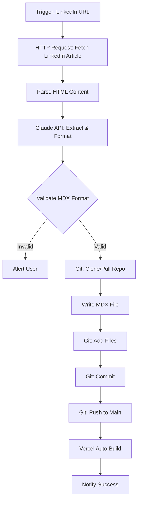

# Blog Automation Strategy

**Status:** Planning
**Created:** 2025-10-19
**Last Updated:** 2025-10-19

## Overview

This document outlines a strategy for automating the blog content creation and publishing workflow using agentic AI workflows. The goal is to streamline the process of converting LinkedIn articles (and potentially other content sources) into properly formatted blog entries that automatically trigger builds and deployments.

## Problem Statement

Currently, adding new blog entries requires:
1. Manual content extraction from LinkedIn/other sources
2. Manual MDX file creation with proper frontmatter
3. Manual git commit and push
4. Waiting for Vercel to detect and build

This process is repetitive and could be fully automated while maintaining quality and control.

## Current Build Pipeline

The existing Vercel build process automatically handles:
- **Manifest Generation** (`scripts/generate-manifest.ts`): Scans all `.mdx` files and creates `blog-manifest.json`
- **RSS Feed Generation** (`scripts/generate-rss.ts`): Creates RSS XML from manifest
- **Build Command**: `tsx scripts/generate-manifest.ts && tsx scripts/generate-rss.ts && tsc -b && vite build`

**Key Insight**: Once new `.mdx` files are committed to git, everything downstream is already automated. We just need to automate the content creation → git commit flow.

## Solution Options

### Option 1: n8n + Claude API (Recommended)

**Architecture:**
```
Trigger Source
   ↓
Extract/Parse Content (HTTP/Scraper Node)
   ↓
AI Generation (Claude API Node)
   ↓
Validation (Function Node)
   ↓
Git Operations (Git Node or Execute Command)
   ↓
Notification (Optional)
```

**Advantages:**
- Visual workflow builder (easy to debug and modify)
- Native git integration
- Multi-step orchestration with branching logic
- Can use Claude API (better for code/content generation)
- Can integrate multiple AI providers
- Self-hosted option for full data control
- Built-in error handling and retry logic
- Human-in-the-loop approval steps possible

**Disadvantages:**
- Requires n8n instance (cloud or self-hosted)
- Additional service to maintain
- Learning curve for n8n workflows

**Best For:**
- Complex multi-step workflows
- Multiple content sources
- Workflows requiring approval gates
- Integration with other services (email, Slack, etc.)

---

### Option 2: GitHub Actions + Claude API

**Architecture:**
```
GitHub Issue/Webhook/Manual Trigger
   ↓
GitHub Action Workflow
   ↓
Call Claude API (via curl/Python/Node)
   ↓
Generate MDX file
   ↓
Commit directly to repo
   ↓
Vercel auto-builds
```

**Advantages:**
- Lives in GitHub ecosystem
- No external services needed
- Simple for single-purpose automation
- Free for public repos
- Version controlled workflow definitions

**Disadvantages:**
- Less flexible for complex orchestration
- Harder to debug than visual workflows
- Limited to GitHub triggers
- Requires workflow YAML expertise

**Best For:**
- Simple, GitHub-centric workflows
- Developers comfortable with YAML/Actions
- Minimizing external dependencies

---

### Option 3: OpenAI Assistants API

**Architecture:**
```
Trigger (API call)
   ↓
OpenAI Assistant with Functions
   ↓
Custom Functions for Git Operations
   ↓
Commit & Push
```

**Advantages:**
- Deep GPT integration
- Function calling for structured outputs
- Simple for pure AI tasks

**Disadvantages:**
- Limited git integration (needs custom tooling)
- Requires separate infrastructure for git operations
- Less orchestration flexibility
- Locked into OpenAI ecosystem

**Best For:**
- Pure AI content generation tasks
- OpenAI-first workflows
- Simple single-step automations

---

## Recommended Approach: n8n + Claude API

### Why This Combination?

1. **Multi-step Complexity**: Blog automation requires AI generation + git operations + file formatting + validation. n8n excels at chaining these steps with clear visual feedback.

2. **Git Operations**: n8n has native git nodes and can execute shell commands directly. This is critical for committing/pushing.

3. **Claude API Superiority**: For code generation, markdown formatting, and structured content, Claude (especially Sonnet 4.5) outperforms GPT models.

4. **Flexibility**: Easy to add:
   - Human approval steps before publishing
   - Multiple trigger sources (email, webhook, manual button)
   - Fallback logic if AI generation fails
   - Notification systems (Slack, email)
   - Content validation rules

### Detailed Workflow Design

#### Trigger Options
- **Manual**: n8n webhook with LinkedIn URL input
- **Email**: Forward LinkedIn article email to dedicated address
- **Scheduled**: Scrape LinkedIn profile for new articles
- **API**: Call n8n webhook from anywhere

#### Step-by-Step Flow



#### Node Configuration

1. **Webhook Trigger**
   - Input: `{ "linkedinUrl": "https://...", "autoPublish": true }`

2. **HTTP Request Node**
   - Fetch LinkedIn article HTML
   - Handle authentication if needed

3. **Function Node: Parse Content**
   - Extract article title, date, body
   - Clean HTML artifacts

4. **Claude API Node**
   - Prompt: "Generate MDX blog post with frontmatter from this LinkedIn article..."
   - Model: `claude-sonnet-4-5-20250929`
   - Response format: Complete MDX file with frontmatter

5. **Function Node: Validate**
   - Check frontmatter fields (title, publishedAt, author, etc.)
   - Validate slug generation
   - Ensure excerpt exists

6. **Conditional Node**
   - If validation passes → continue
   - If validation fails → alert user + halt

7. **Execute Command Node: Git Clone**
   - `git clone <repo> /tmp/blog-workspace` (if not exists)
   - `cd /tmp/blog-workspace && git pull origin main`

8. **Write File Node**
   - Path: `/tmp/blog-workspace/src/content/blog/{slug}.mdx`
   - Content: MDX from Claude

9. **Execute Command Node: Git Commit & Push**
   ```bash
   cd /tmp/blog-workspace
   git add -A
   git commit -m "Add new LinkedIn article: {title}"
   git push origin main
   ```

10. **Notification Node** (Optional)
    - Slack/Email: "New blog post published: {title}"

#### Claude API Prompt Template

```
You are a blog content generator for Signal Dispatch, a technical blog about AI, architecture, and consulting.

Given this LinkedIn article content, generate a complete MDX blog post with the following structure:

---
title: "{article title}"
publishedAt: "{ISO date from article or current date}"
author: "Nino Chavez"
excerpt: "{first 2-3 sentences, max 200 chars}"
category: "{infer from content: AI & Automation, Consulting, Architecture, etc.}"
tags: ["{relevant tags}"]
featured: false
source: "linkedin"
linkedinUrl: "{original URL}"
---

{article content with proper markdown formatting}

Requirements:
- Use ### for headings (not ##)
- Preserve article structure and tone
- Keep bullet points formatted as markdown lists
- Ensure excerpt captures the hook
- Category must be one of: "AI & Automation", "Consulting", "Architecture", "Systems Thinking"

LinkedIn Article:
{content}
```

### Implementation Phases

#### Phase 1: Manual Trigger (MVP)
- Set up n8n instance (Cloud or self-hosted)
- Create basic workflow: LinkedIn URL → Claude API → MDX file
- Test with 3-5 historical LinkedIn articles
- Validate MDX format and frontmatter

#### Phase 2: Git Integration
- Add git clone/pull/commit/push nodes
- Test end-to-end: URL → git push
- Verify Vercel builds trigger correctly
- Add error handling and notifications

#### Phase 3: Validation & Quality Gates
- Add MDX validation logic
- Implement human approval step (optional)
- Add content quality checks
- Create rollback mechanism if needed

#### Phase 4: Multi-Source Support
- Add support for other content platforms (Medium, Dev.to)
- Create platform-specific parsers
- Unified frontmatter generation

## Technical Requirements

### n8n Setup
- **Hosting**: n8n Cloud (easiest) or self-hosted (Docker)
- **Authentication**: GitHub personal access token for git operations
- **API Keys**: Claude API key (Anthropic)

### Git Configuration
- **Repository**: `nino-chavez/signal-dispatch-blog`
- **Branch Strategy**: Commit directly to `main` or create PRs for review
- **Commit Message Format**: `"Add new LinkedIn article: {title}\n\n🤖 Generated via n8n automation"`

### Claude API Configuration
- **Model**: `claude-sonnet-4-5-20250929`
- **Max Tokens**: 4096 (sufficient for blog posts)
- **Temperature**: 0.3 (more deterministic for formatting)

## Decision Points

Before implementation, decide on:

### 1. Trigger Mechanism
- [ ] Manual webhook (paste URL)
- [ ] Email forwarding
- [ ] Scheduled scraping
- [ ] Browser extension

### 2. Review Process
- [ ] Fully automated (no review)
- [ ] Human approval before commit
- [ ] Auto-commit + manual rollback if needed

### 3. Hosting
- [ ] n8n Cloud ($20/month)
- [ ] Self-hosted n8n (Docker on VPS)
- [ ] GitHub Actions (free alternative)

### 4. Content Sources
- [ ] LinkedIn only
- [ ] LinkedIn + Medium
- [ ] LinkedIn + Dev.to
- [ ] Any URL (generic scraper)

## Success Metrics

- **Automation Rate**: % of blog posts published via automation vs manual
- **Error Rate**: % of workflows that fail or require manual intervention
- **Time Saved**: Minutes saved per blog post (target: 10-15 minutes)
- **Quality**: % of automated posts that don't require editing

## Next Steps

1. **Choose trigger mechanism** (recommendation: manual webhook for MVP)
2. **Set up n8n instance** (Cloud for speed, self-hosted for control)
3. **Obtain Claude API key** (via Anthropic Console)
4. **Build Phase 1 workflow** (LinkedIn URL → MDX generation, no git yet)
5. **Test with 5 historical articles**
6. **Add git integration** (Phase 2)
7. **Deploy to production**
8. **Monitor and iterate**

## Resources

- [n8n Documentation](https://docs.n8n.io/)
- [n8n Cloud](https://n8n.io/cloud/)
- [Claude API Documentation](https://docs.anthropic.com/)
- [GitHub Actions Documentation](https://docs.github.com/en/actions)

## Open Questions

- Do you want to review posts before they go live, or trust the AI fully?
- Should we support drafts (committed to a `drafts/` folder for review)?
- Do you want Slack/email notifications when new posts are published?
- Should the workflow handle image uploads (LinkedIn articles often have images)?

---

**Next Review:** After deciding on trigger mechanism and hosting approach
